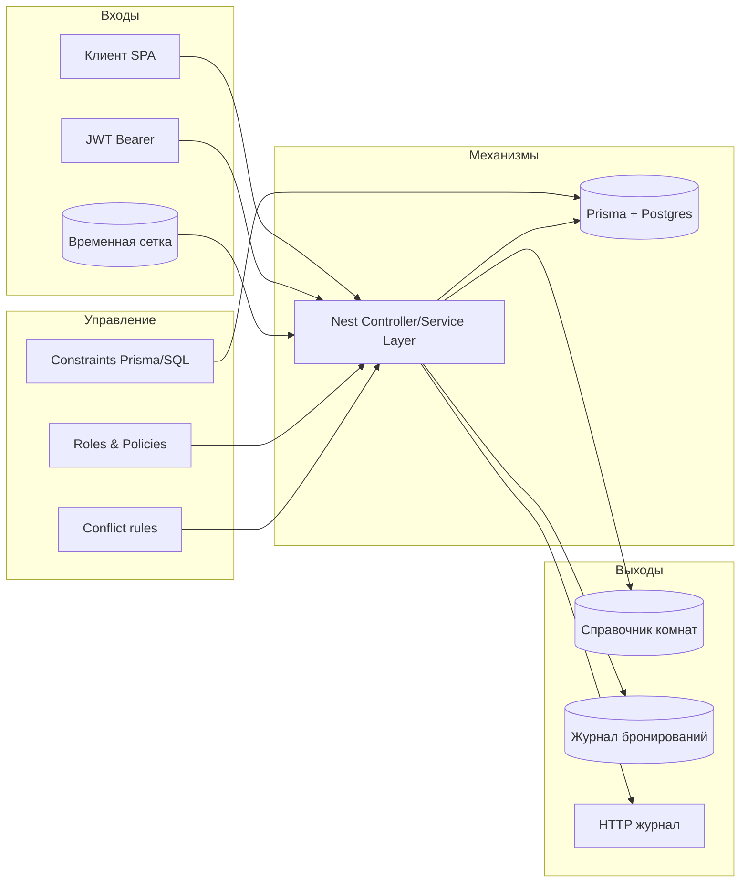
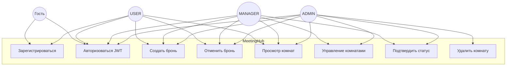
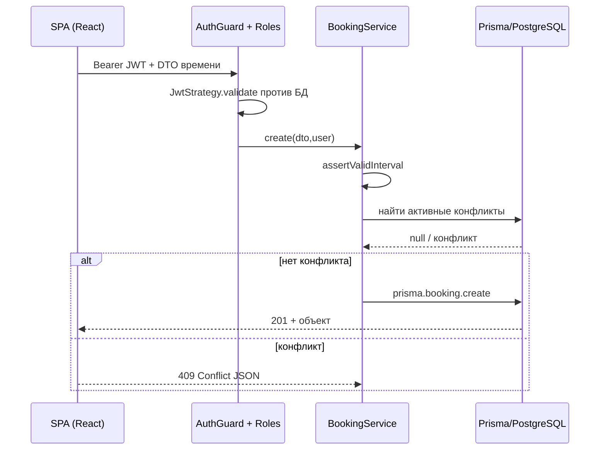
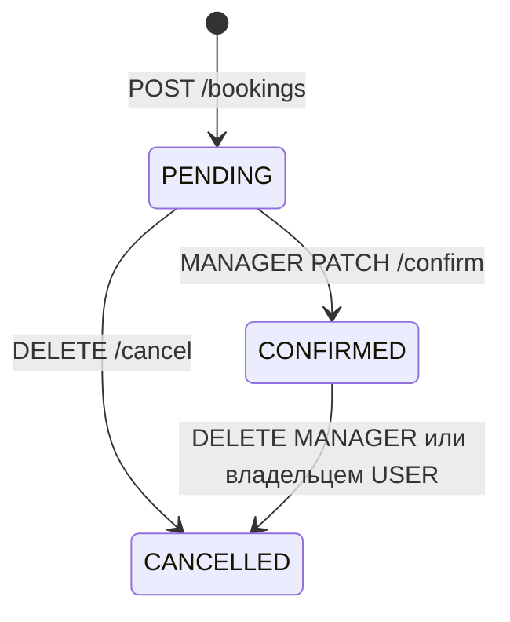
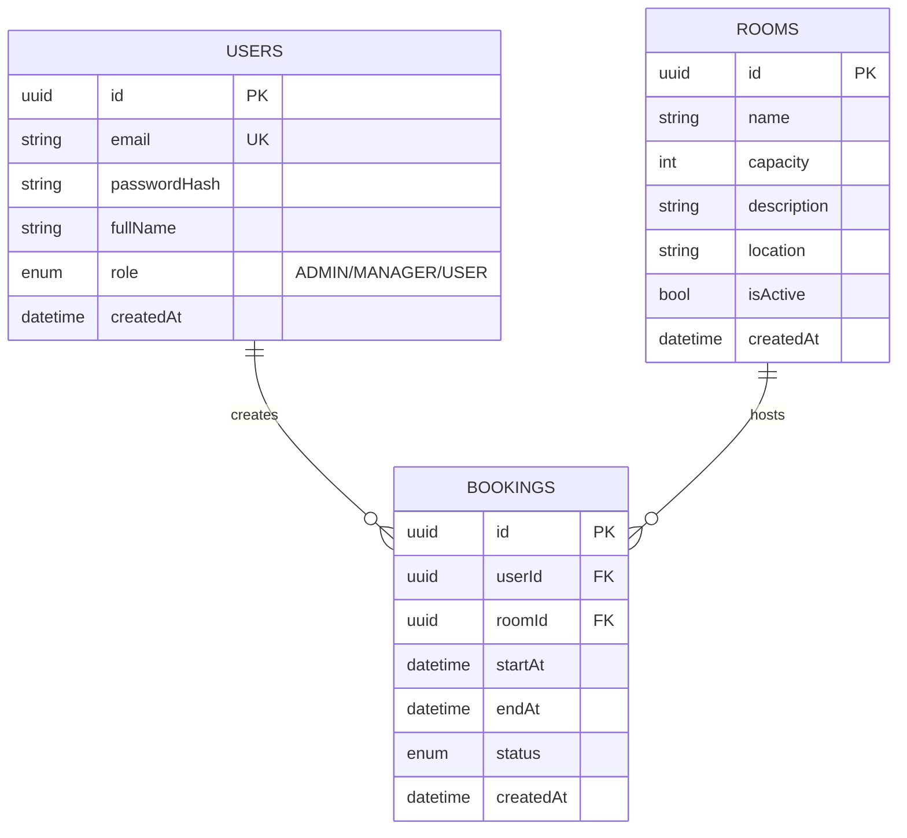

## IDEF0: контекст и декомпозиция процесса

> Примечание: чистые IDEF0-листы обычно оформляются в узкоспециализированном ПО (`Camunda Modeler extensions`, BPWin). Здесь зафиксирована логическая структура в виде текстовых уровней + мнемоническая диаграмма `Mermaid`.

### Контур A-0 («Управлять ресурсами переговорных»)

| Контуры | Артефакты |
| -------- | --------- |
| **Входы** | Запрос клиента SPA, авторизационные данные JWT, параметры времени |
| **Управление** | Правила безопасности RBAC, схема БД Postgres, SLA бизнес-домена |
| **Механизмы** | NestJS API, фронтенд React/Vite, Prisma ORM, Docker |
| **Выходы** | Персистентное состояние бронирований, подтверждённые временные интервалы, аудируемые HTTP-ответы |



### Декомпозиция A1 («Оформление брони» → «Конфликт-чек», «Подтверждение статусов»)

1. **Приём интервала** — валидация DTO (`class-validator`) + авторизационный фильтр.
2. **Проверка пересечений** — поиск активных конфликтующих бронирований того же ресурса.
3. **Создание/обновление** — сохранение в транзакции Prisma без ручного SQL.
4. **Модификации статуса** — ограниченные методами PATCH и подтверждением только для управляющих ролей.

## UML: прецеденты (Use Case)



### Диаграмма последовательности POST `/bookings`



### Диаграмма состояний `Booking`



## ER (логическая схема БД)



## Архитектура приложения и развёртывание

```mermaid
flowchart TB
    subgraph CLIENT["Браузер"]
      SPA_INDEX[SPA (React+Vite сборка)]
      AXIOS[axios over HTTPS/local]
      SPA_INDEX --> AXIOS
    end

    subgraph EDGE["Ingress / nginx :80"]
      PROXY_reverse[Reverse-proxy]
    end

    subgraph API_CLUSTER["NestJS контейнер :4000"]
      MODULE_AUTH[AuthModule]
      MODULE_ROOMS[Roles + RoomsModule]
      MODULE_BOOK[BookingsModule]
      HEALTH[HealthModule]
    end

    subgraph DATA["PostgreSQL :5432"]
      PG[(Coworking DB)]
    end

    AXIOS -->|JSON over HTTP| PROXY_reverse
    PROXY_reverse --> SPA_INDEX
    PROXY_reverse -->|префиксы /rooms...| MODULE_AUTH & MODULE_ROOMS & MODULE_BOOK & HEALTH
    MODULE_AUTH & MODULE_ROOMS & MODULE_BOOK --> PG
```

### Физический стек Compose

Три процесса: `ui` (`nginx`), `api` (`node dist`), `db` (`postgres`). Nginx смешивает статические активы SPA и пробросает JSON к API-сервису внутренней Docker-сети.

Такое разделение демонстрирует «адаптированную» архитектуру: не абстрактный C4 контейнерный рисунок, а схема с реальными маршрутами и технологическими границами проекта.
